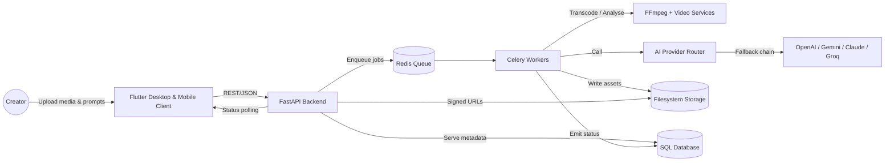

# Platform Documentation

Welcome to the documentation set for the AI Video Editor platform. This folder provides architectural guidance, subsystem deep-dives, and operational runbooks to help engineers, designers, and operators work confidently with the product.

## Architecture Overview

### System Context

### Deployment Topology

The platform is intentionally split into independently scalable units:

| Layer | Responsibility | Technology |
| --- | --- | --- |
| Client | Upload, editing surrogate UI, localisation shells | Flutter (Material 3), Riverpod, go_router |
| API | REST endpoints, configuration, persistence | FastAPI, SQLAlchemy, Pydantic |
| Workers | Long-running media and AI operations | Celery, FFmpeg, custom pipelines |
| Queue | Job transport and back-pressure | Redis 6+ |
| Storage | Durable asset storage and signed-path distribution | File-system (local) with pluggable roots |
| AI Providers | Text understanding, summarisation, transcription | Modular provider adapters with ordered fallback |

## Backend Services Summary

### FastAPI Application Layer
- Route modules live in `backend/app/api/routes/` and are aggregated via `api_router`.
- Requests hydrate typed schemas (`ProcessingJobCreate`, `ProcessingJobRead`, etc.) and leverage repository classes for persistence.
- `backend/app/core/config.py` centralises environment-driven settings, including storage, database URLs, and AI provider behaviour.
- Structured logging is configurable via `LOG_FORMAT`, while health surfaces live under `/health`.

### Media Processing Pipeline
- Job lifecycle orchestration lives in `backend/app/workers/job_manager.py`, with Celery tasks defined in `backend/app/workers/tasks.py`.
- Media ingestion and manipulation use `StorageService`, `ffmpeg_service.py`, `quality_service.py`, and `ranking_service.py`.
- Jobs transition through `PENDING → QUEUED → IN_PROGRESS → COMPLETED/FAILED`, with updates persisted via the repository layer for API polling.

### Background Queue & Execution
- Celery workers are initialised through `backend/app/workers/celery_app.py` and share configuration with the API via environment variables.
- Redis brokers and result backends are configurable with `QUEUE_BROKER_URL`/`QUEUE_RESULT_BACKEND`.
- Failure handling (connection loss, provider errors) is normalised through `ProcessingJobLifecycle.mark_failed` to keep API state consistent.

### AI Orchestration
- `AIProviderRouter` coordinates provider attempts using the ordered list from `AI_PROVIDER_ORDER`.
- Provider adapters live in `backend/app/services/ai/providers/` and expose consistent methods for text, embeddings, and transcription when supported.
- Adaptive retry with exponential backoff and provider-specific usage metrics support observability and privacy auditing (see [`ai-providers.md`](./ai-providers.md)).

## Frontend Structure

The Flutter client follows a layered, feature-first pattern:

- `lib/src/app.dart` bootstraps Riverpod providers, theming, and routing shells.
- `core/` contains cross-cutting concerns (dependency injection, configuration flavors, localisation scaffolding under `core/localization`, responsive breakpoints, and theming).
- `features/` groups UI flows:
  - `shell/` orchestrates layout scaffolds with navigation rail/bottom bar adaptations.
  - `dashboard/`, `workspace/`, and `settings/` host individual screens with placeholder content wired for future data sources.
- `data/` holds repositories and DTO contracts for future backend integration, decoupling transport logic from widgets.
- Generated localisation files (`flutter_gen`) are consumed across the UI to support bilingual plans.

## Testing Strategy

| Layer | Tooling | Focus |
| --- | --- | --- |
| Backend | `pytest` (see `backend/tests/`) | Unit tests for repositories and services, smoke tests for API routes, deterministic fixtures for AI router fallbacks |
| Workers | Celery integration tests (`test_ffmpeg_service.py`, `test_storage_service.py`) | Validates pipeline utilities and failure paths |
| Frontend | `flutter test`, `flutter analyze` | Widget smoke tests, layout assertions, and linting across feature modules |
| Cross-cutting | Contract tests (planned) | Align JSON schemas between Flutter data layer and FastAPI responses |

To execute locally:

- Backend: `python -m pytest backend/tests` from the project root after installing requirements.
- Frontend: `cd frontend && flutter test` and `flutter analyze`.

## Offline & Air-Gapped Deployment Notes

- Set `AI_PROVIDER_ORDER=` to an empty list or stub provider to prevent outbound traffic when operating offline. Custom on-prem adapters can be registered under `backend/app/services/ai/providers/`.
- Use SQLite (default) or point `DATABASE_URL` to a LAN-accessible database. Ensure the `storage_root` directory is available on local disk or a mounted volume.
- Package FFmpeg binaries with the worker container or system image; Celery workers reference the `PATH` at runtime.
- Redis can run locally (e.g., via Docker Compose) when external connectivity is unavailable.
- Review privacy posture: disable verbose logging (`LOG_LEVEL=WARNING`) and rotate storage directories between sessions when dealing with sensitive media.

## Localisation & Bilingual Support Roadmap

- Flutter strings are generated from ARB files in `lib/l10n`. Add new languages by creating `app_<language>.arb` files and running `flutter gen-l10n`.
- Backend responses return plain English today; future localisation should mirror the Flutter keys or expose negotiated locales via request headers.
- Consider contributor guidelines for translations (see [`contributing.md`](./contributing.md)) and ensure screenshots in the user guide demonstrate both LTR and RTL layouts once assets are available.

## Contribution Workflow Summary

Refer to [`contributing.md`](./contributing.md) for branching strategy, coding standards, and pull-request expectations.

Additional deep-dives:

- [`api.md`](./api.md) – REST API reference and examples.
- [`ai-providers.md`](./ai-providers.md) – AI configuration, fallbacks, and privacy notes.
- [`user-guide.md`](./user-guide.md) – End-to-end workflow walkthrough for creators.
