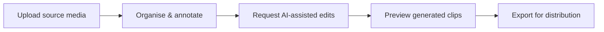
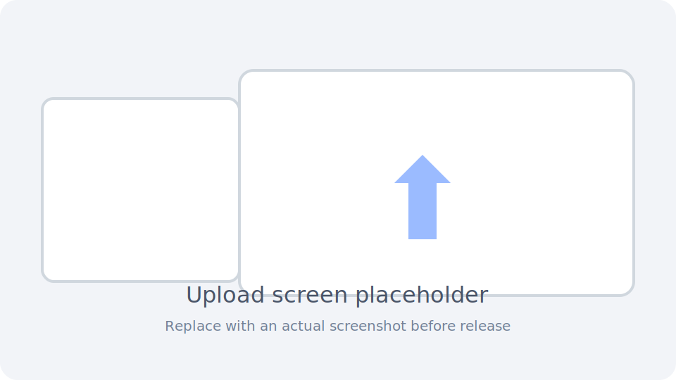
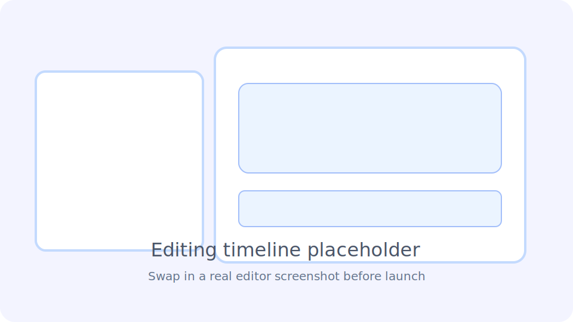
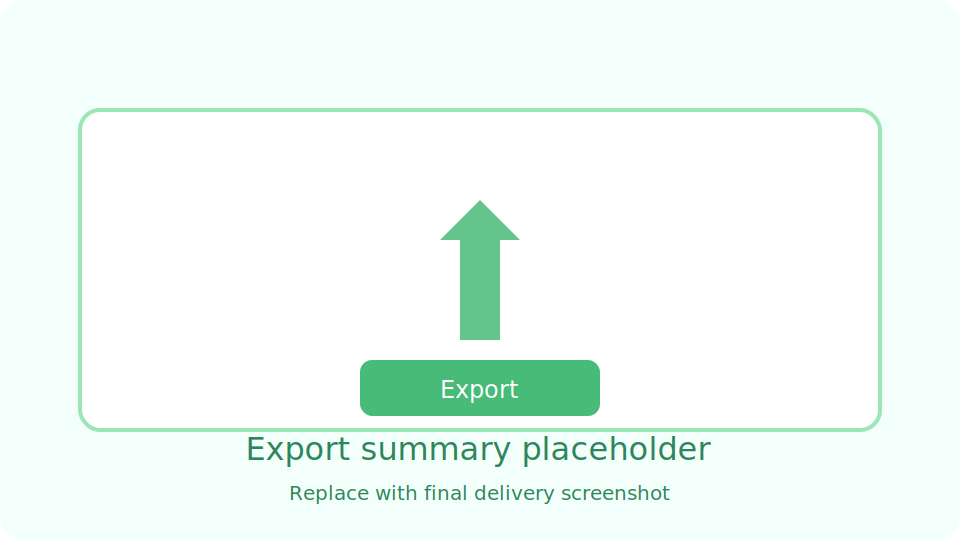

# Creator Workflow Guide

This guide walks through the end-to-end creator experience for producing social-ready clips from long-form video. It mirrors the primary phases surfaced in the Flutter client: **Upload → Edit → Export**.

> Screenshots below use SVG placeholders. Replace them with real captures before the public launch to keep localisation and branding consistent.

## 1. Upload Source Media

1. Launch the desktop application (`flutter run --target lib/main_development.dart`) or mobile build.
2. Select **Create Project** from the Workspace landing page.
3. Choose the long-form source video (supported containers: MP4, MOV, MKV). Large files are streamed to local storage and queued for background ingestion.
4. Optionally provide initial metadata:
   - Project title and description (used for downstream clip naming).
   - Target platforms (TikTok, Reels, Shorts) to pre-select aspect ratios.
   - AI prompt hints (tone, hook, CTA).
5. Confirm to begin the upload. The client polls `POST /jobs` for ingestion status and surfaces progress in the activity drawer.

**Troubleshooting:** Slow uploads usually indicate storage quotas or FFmpeg binaries missing on the worker. Inspect `/health/diagnostics` for queue connectivity or review Celery logs for quota violations (`StorageQuotaExceeded`).

## 2. Edit & Refine Clips

1. Once ingestion completes, Workspace populates draft clips based on AI-suggested segments.
2. Use the **Timeline** panel to fine-tune in/out points. Drag handles or type timecodes for frame-accurate cuts.
3. Apply presets:
   - **Aspect ratio** (9:16, 1:1, 16:9) toggles safe area overlays.
   - **Captions** enable auto-transcription via the AI router when supported providers are enabled.
   - **Brand overlays** load templated lower-thirds from project assets.
4. Request AI refinements:
   - Summaries & Hook suggestions (`AI` sidebar) call `POST /jobs` with `job_type=generate_clip`.
   - Script polish or CTA variants use the same fallback chain documented in [`ai-providers.md`](./ai-providers.md).
5. Review change history in the **Activity** tab. Each background job logs progress messages (e.g., `Transcoding chunk 3/7`).

**Collaboration Tips:**
- Use the forthcoming comments panel (placeholder today) to leave timestamped notes.
- Duplicate a clip to experiment with alternative aspect ratios without disrupting approved versions.

## 3. Export & Publish

1. When a clip status reaches **Ready**, open the Export sheet.
2. Choose delivery targets:
   - **Social presets** apply platform-specific bitrates and durations.
   - **Archive** generates mezzanine quality for hand-off.
3. (Optional) Attach call-to-action overlays or end cards.
4. Trigger **Export** to enqueue a `job_type=export` task. The queue worker handles FFmpeg rendering and uploads the asset to the storage root.
5. Download the rendered file via signed path links exposed by the API or initiate direct platform uploads in future releases.

**Best Practices:**
- Keep exports under 60 seconds for Shorts/Reels to avoid downstream re-encoding.
- Review the automated quality ranking (from `quality_service.py`) before publishing; rerun the job if the score is below the configured threshold.

## Keyboard & Accessibility Shortcuts

| Action | Shortcut (desktop) |
| --- | --- |
| Play/Pause | `Space` |
| Nudge in/out point | `←` / `→` |
| Toggle captions overlay | `C` |
| Switch aspect ratio | `Shift + A` |

Mobile builds expose equivalent actions via long-press context menus. All controls will expose screen-reader labels once localisation assets are finalised.

## Localisation & Future Bilingual Support

- The Flutter client relies on ARB files under `lib/l10n`. Add translations for workflow copy (`workspaceTitle`, `workspaceDescription`, etc.) before capturing final screenshots.
- Ensure exported captions honour the selected locale. When AI transcription is unavailable (offline mode), fall back to manual subtitle upload.

## Related Documentation

- [`README.md`](../README.md) – Environment setup and quickstart.
- [`docs/ai-providers.md`](./ai-providers.md) – Configure AI assistants powering timeline refinements.
- [`docs/api.md`](./api.md) – Job orchestration endpoints used during upload and export phases.
